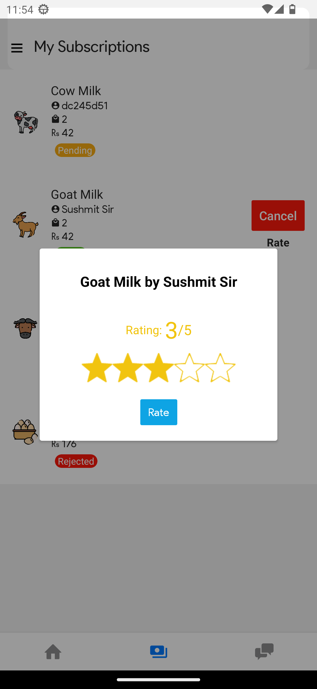
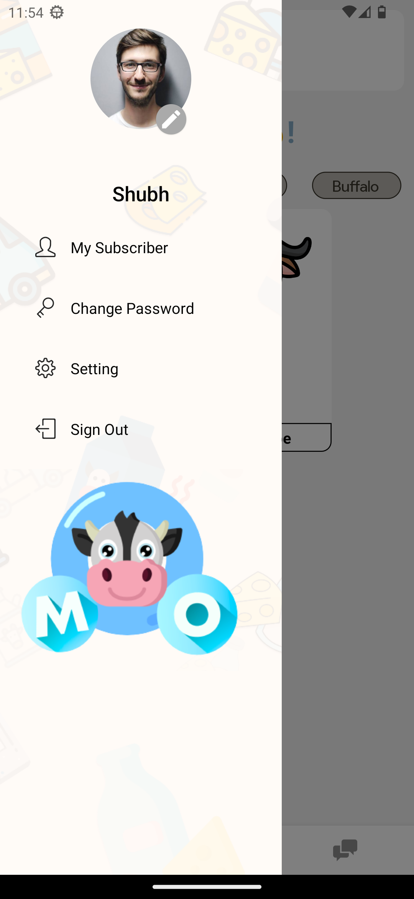
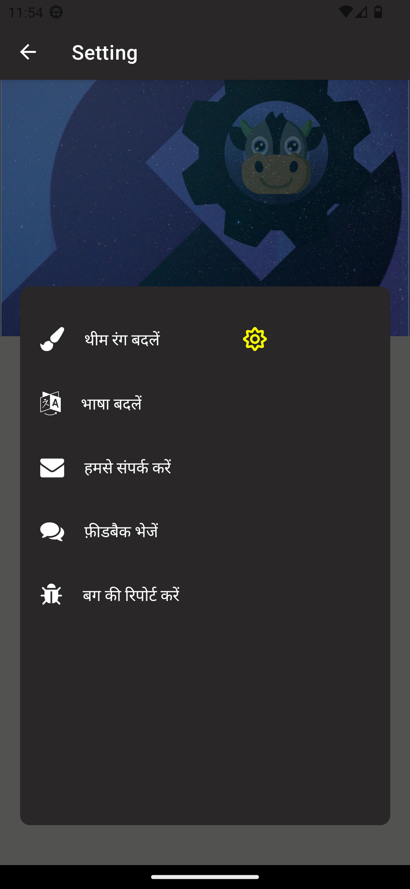
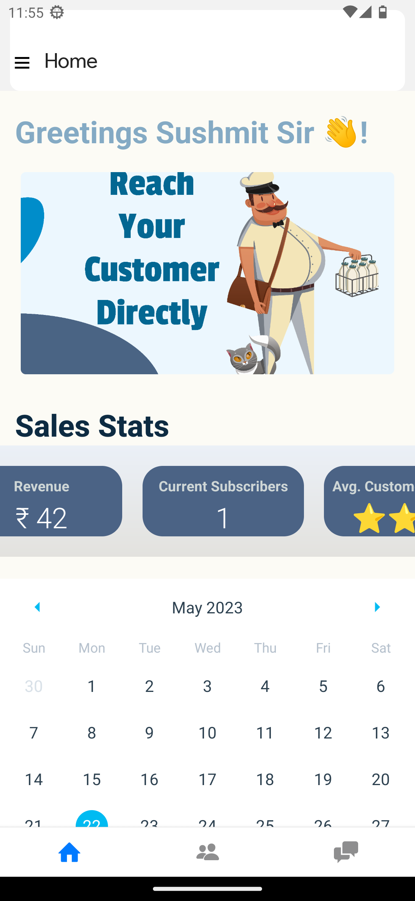

# Moo - Your Doorstep Dairy

This is the GitHub repository for the React Native project "Moo - Your Doorstep Dairy." It was developed as part of the Geek For Geek Solving for India Hackathon, focusing on the AgroTech theme.

## What is Moo?

Moo is a React Native project developed to address the challenges faced by local milkmen and consumers in the dairy industry. It aims to provide a user-friendly solution that allows consumers to easily find reliable milk suppliers and enables sellers to expand their business by connecting with customers in new locations. With features such as multilingual support, privacy protection, rating systems, and automatic bill generation, Moo simplifies communication, boosts small and large-scale dairy businesses, and enhances the overall milk purchasing experience.


## Installation Instructions:

1. Clone the repository using the following command:
   ```
   git clone https://github.com/your-username/moo.git
   ```

2. Navigate to the project directory:
   ```
   cd moo
   ```

3. Install the required dependencies:
   ```
   npm install
   ```

4. Start the development server:
   ```
   yarn run android
   ```

5. Follow the instructions shown in the terminal to run the app on a physical device or emulator.


## Backend Repository:
You can find the backend code for Moo at the following GitHub repository:
- [MooApi Backend Repository](https://github.com/tr1ten/MooApi)

## Screenshots:


*Buyer's home page*


*Buyer's subscription tab*


*Profile Section*


*Regional Support & Dark mode*


*Seller Home*


## Technology Stack:
- React-Native for the frontend
- Node/Express for the backend
- Google Cloud services for the database
